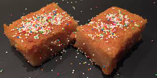

# Surinaamse cake Bojo

## ingerdienten

- snuifje zout
- 11/2 kopje melk
- 300 gram suiker
- 1 eetlepel kaneel
- 2-3 pakjes 16 gram vaniliesuiker
- 50 gram sucade
- 1 theelepel amandel
- 150 gram roomboter
- suikermuisjes
- 1kg cassave
- handvol gemalen vers kokos
- 20 ml kokos melk

### bereidingswijze

**Ontdooi de geraspte cassave, lek het uit en meng het met een spatel met de overige ingrediënten, behalve de suikermuisjes; de massa overdoen in een beboterde cakeblik of in een vuurvaste ovenschaal en als volgt gaarbakken:
Heteluchtoven: 20 minuten op 190 graden.
Elektrische oven: 45 minuten op 200 graden.
Met een vork prikken om te kijken of de Bojo goed gebakken is.*

